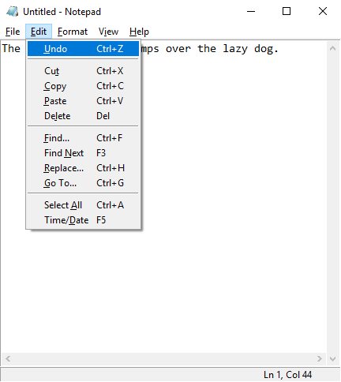

# notepad
Python clone of Microsoft's classic text editor.

**Installation and Requirements**
1. Python 3.6ish standard install required
2. Should work on Linux and Windows systems
3. Download files, place in directory
4. In terminal emulator of choice:

    a. Navigate to directory

    b. run 'python3 notepad.py'
5. Fun, or Profit, or Both, or Neither.

**Design Philosophy**

  I. Don't fix what isn't broken. Editor is fine.
  
 II. Don't stick to any particular version -- just the "greatest hits".
 
III. When in doubt, make it behave exactly like Notepad.

 IV. Don't reinvent the wheel.
 
  V. Pull requests welcome.
